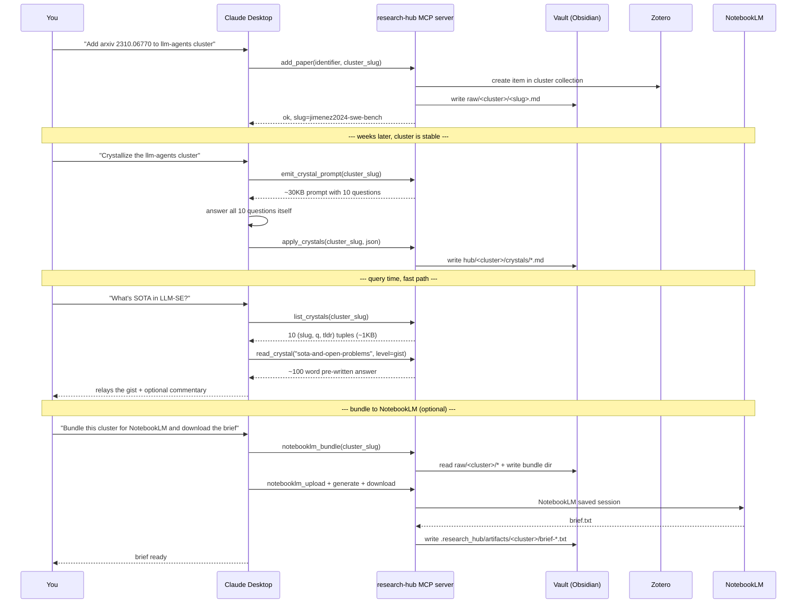

# Example: Claude Desktop + research-hub MCP

A worked example of the full crystal generation + query flow, as seen from the Claude Desktop user's seat. This is what the experience should feel like once your MCP server is wired in.

> **Prerequisites:** `pip install research-hub-pipeline[playwright]` + `research-hub init` + `research-hub install --mcp` + restart Claude Desktop.

---

## How it fits together



Every arrow above is a single MCP tool call (or its CLI equivalent). The crystal layer is what makes the "weeks later" path fast: 30 KB → 1 KB compression for typical questions.

---

## Setup verification

```
You: Claude, can you list my research clusters?

Claude: [calls list_clusters via MCP]
        I see 1 cluster in your research-hub vault:
        
        - llm-agents-software-engineering (20 papers, 4 sub-topics, 0 crystals)
```

If Claude says "I don't have access to research-hub tools," restart Claude Desktop after running `research-hub install --mcp`.

---

## Step 1 — Add a paper

```
You: Add arxiv 2310.06770 to the llm-agents-software-engineering cluster.

Claude: [calls add_paper(identifier="2310.06770", cluster_slug="llm-agents-software-engineering")]
        Added "SWE-bench: Can Language Models Resolve Real-World GitHub Issues?" 
        (Jimenez et al. 2024). Saved to:
        - Zotero collection: WNV9SWVA
        - Obsidian: raw/llm-agents-software-engineering/jimenez2024-swe-bench.md
        - Dedup index updated.
```

Behind the scenes Claude called the `add_paper` MCP tool. research-hub:
1. Resolved the arXiv ID via OpenAlex
2. Created Zotero entry in the cluster's bound collection (v0.30 fix — used to silently route to default)
3. Wrote the Obsidian note with frontmatter (title, authors, year, doi, topic_cluster, labels)
4. Updated dedup_index.json

---

## Step 2 — Generate crystals for the cluster

```
You: This cluster has been stable for a while now. Crystallize it so future 
     queries don't have to re-read every paper.

Claude: [calls emit_crystal_prompt(cluster_slug="llm-agents-software-engineering")]
        Got the prompt. It asks me to answer 10 canonical questions about this 
        cluster, based on all 20 papers. Generating now...
        
        [Claude reads the prompt and produces JSON with 10 crystal answers]
        
        [calls apply_crystals(cluster_slug=..., crystals_json=<json>)]
        
        Wrote 10 crystals to hub/llm-agents-software-engineering/crystals/:
        - what-is-this-field
        - why-now
        - main-threads
        - where-experts-disagree
        - sota-and-open-problems
        - reading-order
        - key-concepts
        - evaluation-standards
        - common-pitfalls
        - adjacent-fields
        
        Each crystal has a TL;DR (1 sentence), Gist (~100 words), and Full 
        (~1000 words with evidence wiki-links).
```

This is the moment the architecture shifts. From now on, querying this cluster doesn't reload all 20 abstracts.

---

## Step 3 — The future query (the payoff)

A week later, you (or anyone with access to your vault) asks:

```
You: What's the SOTA in LLM-for-software-engineering right now? And what's 
     still unsolved?

Claude: [calls list_crystals(cluster_slug="llm-agents-software-engineering")]
        [sees crystal slug "sota-and-open-problems" with TL;DR matching the question]
        [calls read_crystal(cluster_slug=..., crystal_slug="sota-and-open-problems", level="gist")]
        
        Based on your vault:
        
        SWE-bench accuracy moved from ~1% (Jimenez 2024 baseline) to ~33% 
        (Anthropic claude-3.5-sonnet + Devin-style scaffolding, mid-2025). 
        The frontier shifted from "can it work" to "what does correctness 
        beyond pass@k look like?" — see [[jain2024-livecodebench]] for 
        contamination-aware eval and [[wu2025-humanevalcomm]] for clarification 
        ability. Open: long-horizon multi-file edits, test repair under 
        ambiguous specs, domain transfer beyond Python/JavaScript.
        
        (Want the full ~1000-word version with the evidence table?)

You: Yes please.

Claude: [calls read_crystal(..., level="full")]
        [returns the long answer with section headings, inline wiki-links, and 
         the evidence table mapping each claim to specific papers]
```

**Token cost of this query:**
- Without crystals: ~30 KB (all 20 abstracts + cluster overview)
- With crystals: ~1 KB (10 crystal tuples + the gist) → ~30× compression
- For the follow-up "full" version: ~3 KB total

The pre-written answer is also deterministic — every future query gets the same response, no model variance.

---

## Step 4 — Adding a paper later (staleness)

You add 2 papers to the cluster a few weeks later:

```
You: Add arxiv 2502.XXXXX and 2503.YYYYY to llm-agents-software-engineering.

Claude: [adds both via add_paper × 2]
        Done. Cluster now has 22 papers (was 20).

You: Are the crystals still fresh?

Claude: [calls check_crystal_staleness(cluster_slug=...)]
        Delta ratio is 10% (2 new papers / 20 baseline). All 10 crystals are 
        flagged STALE. To regenerate:
        
          research-hub crystal emit --cluster llm-agents-software-engineering > prompt.md
        
        Or you can ask me to do it now via the same MCP flow as before.

You: Just do it.

Claude: [calls emit_crystal_prompt(...) → reads → answers → calls apply_crystals(...)]
        Crystals refreshed. Now based on all 22 papers.
```

---

## Step 5 — Sub-topic split for a big cluster

Years later, this cluster has grown to 200 papers spanning 5 distinct sub-areas:

```
You: This cluster is getting unwieldy. Help me split it.

Claude: [calls suggest_cluster_split(cluster_slug="llm-agents-software-engineering")]
        Ran citation-graph community detection. Suggests 5 sub-topics:
        
        1. benchmark-design (12 papers) — top shared refs: SWE-bench, 
           HumanEval, MBPP
        2. agent-scaffolding (45 papers) — top shared refs: SWE-agent, 
           OpenDevin, ReAct
        3. test-generation (28 papers) — top refs: EvoSuite, FuzzGym
        4. code-repair (33 papers) — top refs: APR survey, GenProg
        5. multi-file-editing (35 papers) — top refs: long-context survey
        
        Modularity score: 0.71 (high — communities are well-separated).
        
        Want me to write the split as a markdown report, or apply directly?

You: Write the report; I'll review before applying.

Claude: [writes docs/cluster_autosplit_llm-agents-software-engineering.md]
        Report saved. Open it in your editor, edit sub-topic names if needed, 
        then run:
        
          research-hub topic apply-assignments --cluster llm-agents-software-engineering --report <path>
```

---

## What you should NOT see

If at any point Claude says:

- *"I don't have your paper text, but based on my training data..."* — MCP tool didn't fire. Check `research-hub doctor`.
- *"Let me read each paper in this cluster to answer..."* (then 30+ seconds of tool calls) — Crystals aren't generated yet. Run the Step 2 flow once.
- *"I can't access path '../../etc/passwd'..."* — research-hub's path-traversal protection (v0.30+) caught a bad slug. Check the slug you passed.

---

## The token economics (why this matters)

Per-query cost over time, assuming weekly cluster questions:

| Approach | Tokens/query | Cost/query (Claude Opus) | Cost/year (52 queries) |
|---|---|---|---|
| Read all paper notes | ~30,000 | $0.45 | $23.40 |
| Read cluster digest | ~10,000 | $0.15 | $7.80 |
| Read crystal (gist) | ~1,200 | $0.018 | $0.94 |
| Read crystal (full) | ~3,500 | $0.053 | $2.74 |

For a 5-cluster vault answered weekly: **~$117/year → ~$5/year** if you use crystals as the default.

You pay the generation cost ONCE per cluster (~$0.30 for a 20-paper Opus generation). Amortized over a year, crystals pay for themselves in ~5 queries.

---

## See also

- [Anti-RAG architecture explainer](anti-rag.md) — why this works
- [MCP tools reference](mcp-tools.md) — full list of 50+ tools
- [Quick start](../README.md#quickstart-5-commands) — install + first paper in 5 commands
